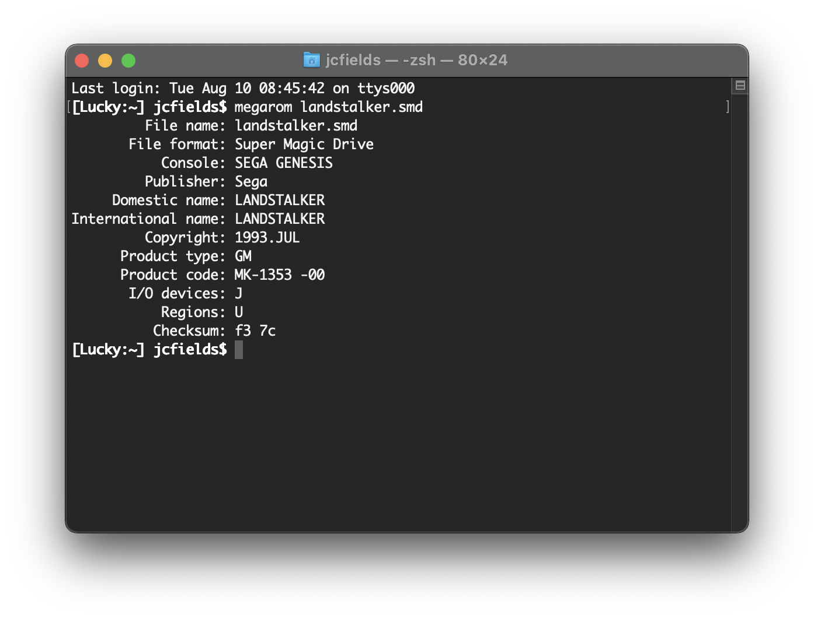

# genesis-rom-converter

A command-line program for displaying header information about and converting Sega Genesis/Mega Drive ROM images. Written in C.

## Guide

Usage: `megarom input_file [output_file]`

If one argument given, shows ROM header information.

If two arguments given, converts bin to smd or smd to bin. Automatically detects format of input file.

## Acknowledgments

This is basically a rewrite of [GROM](https://www.zophar.net/utilities/segautil/grom.html) by [Bart Trzynadlowski](https://www.trzy.org/), with the following differences:

- Determines the format from the file contents instead of the file extension
- Requires the user to specify an output file
- Only works on one file at a time rather than accepting multiple inputs (use a shell `for` loop instead)

The last two make it work more consistently with other Unix utilities and more scriptable.

## Authors

- J.C. Fields <jcfields@jcfields.dev>

## License

- [MIT license](https://opensource.org/licenses/mit-license.php)

## See also

- [Genesis ROM Utility](https://github.com/jcfieldsdev/genesis-rom-utility)—A GUI program with similar functionality.
